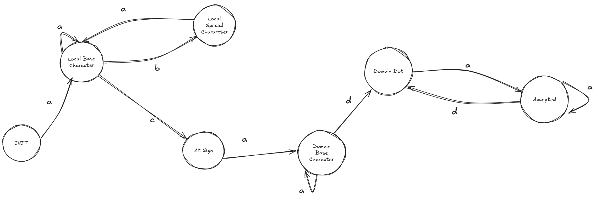
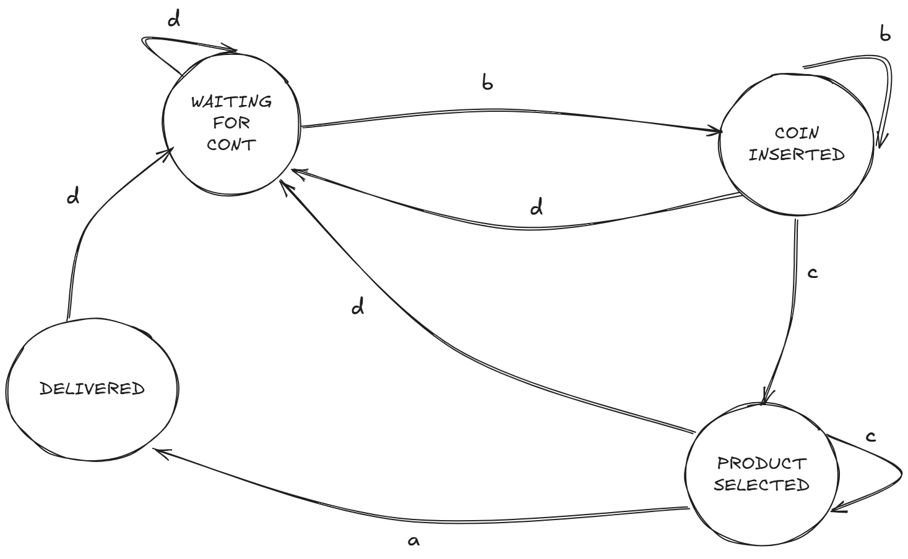
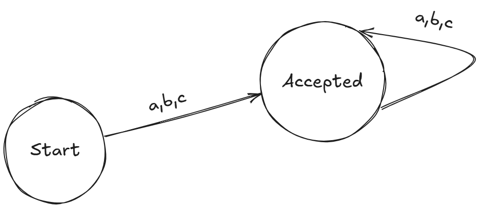

# Implementación de Autómatas Finitos Deterministas (DFA)

Este proyecto implementa tres DFAs para validación de correos electrónicos, expresiones regulares y control de una máquina expendedora.

## 1. Validador de Correos Electrónicos (EmailValidator)
Verifica direcciones de correo electrónico validando parte local, @, dominio y extensión.

### Tabla de Inputs del EmailValidator

| Alias | Valor     |
|-------|-----------|
| a     | [a-z-0-9] |
| b     | [._-%+]   |
| c     | @         |
| d     | .         |

### Tabla de Transiciones del EmailValidator

| Estado Actual | Entrada (char) | Estado Siguiente | Descripción |
|--------------|----------------|------------------|-------------|
| Init | a              | LocalBaseChar | Primer carácter válido de la parte local |
| LocalBaseChar | a              | LocalBaseChar | Continúa la parte local con caracteres válidos |
| LocalBaseChar | b              | LocalSpecialChar | Carácter especial en la parte local |
| LocalSpecialChar | a              | LocalBaseChar | Después de especial, vuelve a carácter normal |
| LocalBaseChar | c              | AtSign | Separador de parte local y dominio |
| AtSign | a              | DomainBaseChar | Primer carácter del dominio |
| DomainBaseChar | a              | DomainBaseChar | Continúa el dominio |
| DomainBaseChar | d              | DomainDot | Punto en el dominio |
| DomainDot | a              | Accepted | Extensión del dominio (.com, .org, etc.) |

### Diagrama del EmailValidator


### Ejemplos de Validación de Emails

| Entrada | Resultado | Explicación |
|---------|-----------|-------------|
| usuario@dominio.com | ✅ Válido | Formato correcto de email |
| usuario.nombre@dominio.com | ✅ Válido | Permite punto en parte local |
| usuario@sub.dominio.com | ✅ Válido | Permite múltiples puntos en dominio |
| usuario@dominio | ❌ Inválido | Falta el TLD (.com, .org, etc.) |
| @dominio.com | ❌ Inválido | Falta la parte local |
| usuario..nombre@dominio.com | ❌ Inválido | Puntos consecutivos no permitidos |

## 2. Máquina Expendedora (VendingMachine)

La máquina expendedora simula un sistema real de venta de productos utilizando un autómata para controlar el flujo de operaciones y garantizar que las transiciones entre estados sean válidas.

### Tabla de Inputs de la Máquina Expendedora

| Alias | Nombre (en código) | Valor |
|-------|-------------------|--------|
| b     | InsertCoin | Evento de inserción |
| c     | SelectProduct | Evento de selección |
| a     | Dispense | Evento de entrega |
| d     | RequestChange | Evento de devolución |

### Tabla de Transiciones Completa de la Máquina Expendedora

| Estado Actual | Entrada | Estado Siguiente | Descripción |
|--------------|---------|------------------|-------------|
| WaitingForCoin | InsertCoin | CoinInserted | Se inserta una moneda |
| CoinInserted | SelectProduct | ProductSelected | Se selecciona un producto |
| CoinInserted | RequestChange | WaitingForCoin | Se solicita devolución |
| ProductSelected | Dispense | ProductDelivered | Se entrega el producto |
| ProductDelivered | * | WaitingForCoin | Vuelve al estado inicial |

### Diagrama de la Máquina Expendedora


### Estados y sus Significados

1. **WaitingForCoin**: Estado inicial, esperando inserción de moneda
2. **CoinInserted**: Moneda insertada, esperando selección o devolución
3. **ProductSelected**: Producto seleccionado, listo para dispensar
4. **ProductDelivered**: Producto entregado, finalizando transacción

## 3. Validador de Expresiones Regulares (RegexValidator)

El RegexValidator es un autómata configurable que valida cadenas contra patrones específicos definidos por el usuario. A diferencia de los otros dos autómatas, este es más flexible ya que construye su tabla de transiciones dinámicamente basándose en el patrón proporcionado.

### Tabla de Transiciones del Validador de Expresiones Regulares

| Estado Actual | Entrada | Estado Siguiente | Descripción |
|--------------|---------|------------------|-------------|
| Start | a | Validate | Procesa letra |
| Start | b | Validate | Procesa número |
| Start | c | Validate | Procesa carácter especial |
| Validate | a | Validate | Continúa procesando letras |
| Validate | b | Validate | Continúa procesando números |
| Validate | c | Validate | Continúa procesando especiales |

### Diagrama del Validador de Expresiones Regulares


> Nota: Las transiciones dependen de la configuración (allowLetters, allowNumbers, allowSpecials). La tabla muestra el caso donde todos están permitidos. El estado Validate es también un estado de aceptación.

### Tabla de Patrones del Validador de Expresiones Regulares

| Patrón | Valor        | Acción                                                                 |
|-------|--------------|------------------------------------------------------------------------|
| a     | [a-zA-Z]     | Permite letras mayúsculas y minúsculas                                 |
| b     | [0-9]        | Permite numeros                                                        |
| c     | [-_.!@#$%&*] | Permite los caracteres especiales definidos en ASCII (sin extensiones) |


### Ejemplos de Validación de Expresiones Regulares

| Entrada | Patrón | Resultado | Explicación |
|---------|--------|-----------|-------------|
| "abc123" | c      | ✅ Válido | Contiene solo letras minúsculas y números |
| "ABC123" | ab     | ❌ Inválido | Contiene letras mayúsculas |
| "123" | b      | ✅ Válido | Contiene solo números |
| "test@" | ac     | ✅ Válido | Termina con @ |
| "123.456" | bc     | ✅ Válido | Número decimal válido |

## Arquitectura

La implementación utiliza una arquitectura modular basada en la interfaz `IDfa<TState, TInput>`:

```csharp
public interface IDfa<TState, TInput> where TState : Enum
{
    DfaBase<TState, TInput> BuildDfa();
}
```

Cada autómata se compone de:
- **Estados**: Enumeraciones que definen los estados posibles
- **Entradas**: Tipos de entrada (caracteres o eventos)
- **Transiciones**: Diccionario de (Estado, Entrada) → Nuevo Estado
- **Servicios**: Capa de abstracción para manejo de errores y validaciones

## Tecnologías Utilizadas

ASP.NET Core (Minimal API), C# 8.0, HTML/CSS, Javascript

## Justificación DFA vs NFA

Se eligió DFA sobre NFA por:

1. **Eficiencia**: O(1) por entrada vs complejidad exponencial en NFAs
2. **Predictibilidad**: Crucial para sistemas como máquinas expendedoras
3. **Implementación**: Más simple y menos propensa a errores
4. **Recursos**: Menor consumo de memoria al no mantener múltiples estados
5. **Caso de Uso**: Suficiente para validaciones simples y control de estados

## Implementación

```csharp
public class DfaBase<TState, TInput>
{
    public TState StartState { get; init; }
    public HashSet<TState> AcceptStates { get; set; }
    public Dictionary<(TState, TInput), TState> Transitions { get; set; }
}
```

### Funcionamiento
- **Inicialización**: Estado inicial definido
- **Procesamiento**: Transición única por (estado, entrada)
- **Aceptación**: Verificación contra estados finales
- **Errores**: Manejo de entradas inválidas y estados indefinidos

## Referencias

1. Hopcroft, J. E., et al. (2006). *Introduction to Automata Theory, Languages, and Computation*
2. [dotnet/runtime RegexCharClass.cs](https://github.com/dotnet/runtime/blob/main/src/libraries/System.Text.RegularExpressions/src/System/Text/RegularExpressions/RegexCharClass.cs)
3. Sipser, M. (2012). *Introduction to the Theory of Computation*
